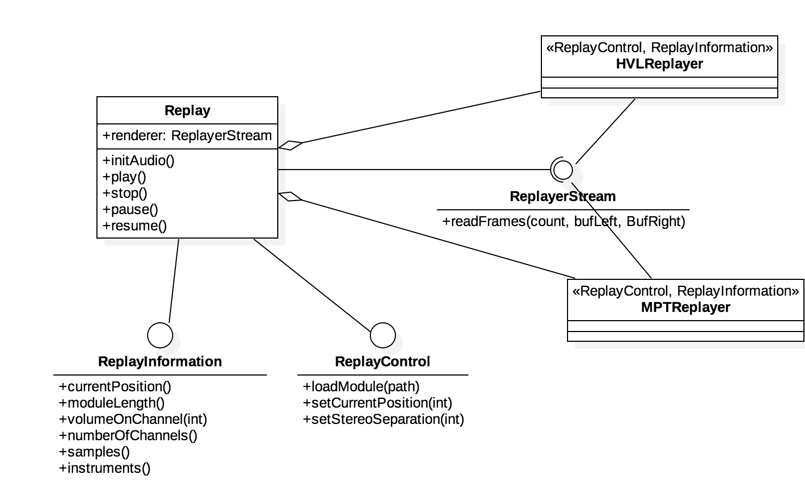

# 4champ Development Journal

### 23 July 2018 Power on!
In the scorching heat wave we had in Finland in July 2018 it was too hot to go out, so I sat down near the air conditioning and put together the Radio feature basics. The option to store modules locally is not implemented yet, but you can listen to two 4champ radio channels: *All* plays tunes from the entire collection (as of today 149123 modules). *New* Plays most recently added tunes (which does not mean that they're new - most of the additions are older ones, but often around Demoscene party weekends there is a set of all fresh modules too). In addition to the basic audio playback, you can also now see volume bars visualisation and module internal texts by tapping the now playing area at the bottom of the screen when the radio is on. Yay!

### 12 June 2018 Setting up the scene for rewrite

As explained below, quite a bit of hours have been poured into the 4champ version 2.1 that never got out. However, coming back to the code after a significant break - we're talking a year or so, it just did not feel comfortable to continue from there, with all the legacy Objective-C code (some of it the very first lines of iPhone sw I ever wrote).

So a rewrite it is. I have a couple of google analytics hooks in the app store version, and looking at the figures it is pretty clear that where the app is still used it is mostly used for the radio feature. The average session duration is around half an hour, so for those who still use it, use it quite a bit.

Therefore I've decided to start with the radio feature. The first milestone is to get the radio feature + about page working, so that I can perhaps start to really dig into getting the app also back listed on the store. 

The first commit towards this target was done on June 12 and it was just the About view skeleton set up using Clean Swift templates. More to follow later.

### 21 April 2018 I can hear things
It was time for a rewrite on the replay routine that handles modules for 4champ. In the original app, playlist handling and replay were bundled in a single player class that used modplug to render the modules into audio stream. I wanted to avoid such tight coupling, and decided to implement the playing of modules in a way that allows for swapping the actual player libraries on the fly.

For now, I'm sticking with two libs: **libOpenMPT** and **HivelyTracker**. The first has a C++ interface, and the second is a C implementation. Since Swift does not have direct C/C++ interoperability, the Swift-facing Replay class and the library-specific wrappers are written in Objective-C. 

To test run my implementation I also wrote a very bare-bones sample mod player app that bundles a set of different types of modules that resides under 
SamplePlayer folder in the [4champ repository](https://github.com/sitomani/4champ/). You can try that out, just build the app in xcode and run in simulator or device. 

### 17 April 2018
Decided to start from the dependencies - I had LibOpenMPT integrated in my original project, but it was a very clumsy
hack. In fact, I did not remember quite exactly how I put the iOS build together and after updating to latest OpenMPT sources
from github I was facing some build errors.

Some tweaking with the OpenMPT Lua scripts and I could get the thing to work, somewhat. Premake5 official release does not work too well for iOS projects so it took a pbxproj file script hack to get it done, and building requires a manual step to add the dependency libraries to linking phase, but now I have it under my OpenMPT fork at [https://github.com/sitomani/openmpt](https://github.com/sitomani/openmpt).

Output from the build scripts in my fork repo is a fat binary for libopenmpt-small containing all the necessary architectures for 4champ. 

### 3 April 2018

These pages are created to document my development efforts and related endeavours around 4champ mod player app.
I hope publishing my progress here will inspire me to give the project a nudge more often than during past months.

As a first entry to this dev journal I guess it would make sense to introduce the project and the goals, 
as I have not pushed any code yet. Basically, I have two main goals for 4champ in 2018:

1. Rewrite the app in Swift. I'll write down the [history of 4champ](app_history.md) on a separate page where I'll
elaborate why I want to do the rewrite.
2. Find a way to get listed on AppStore again. The story about [why I had to remove 4champ from AppStore](appstore_removal.md) 
will also be posted on a separate page

